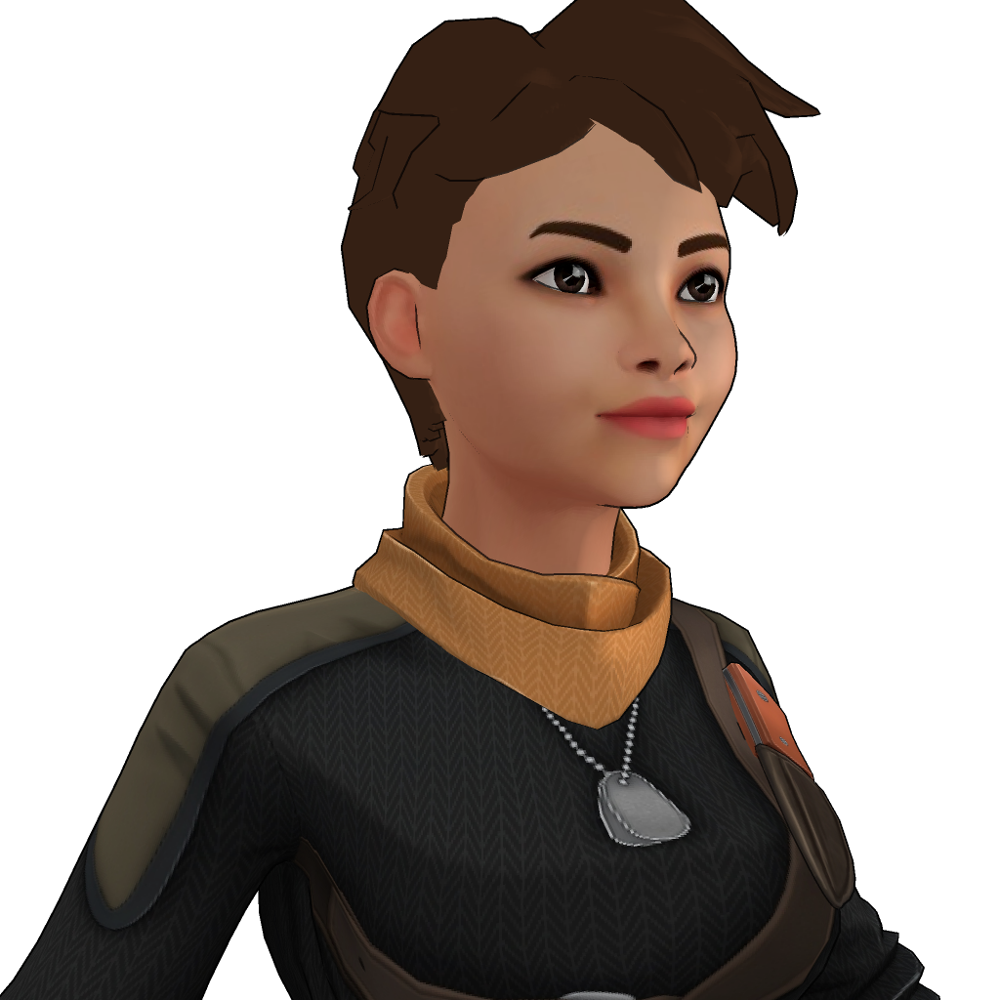
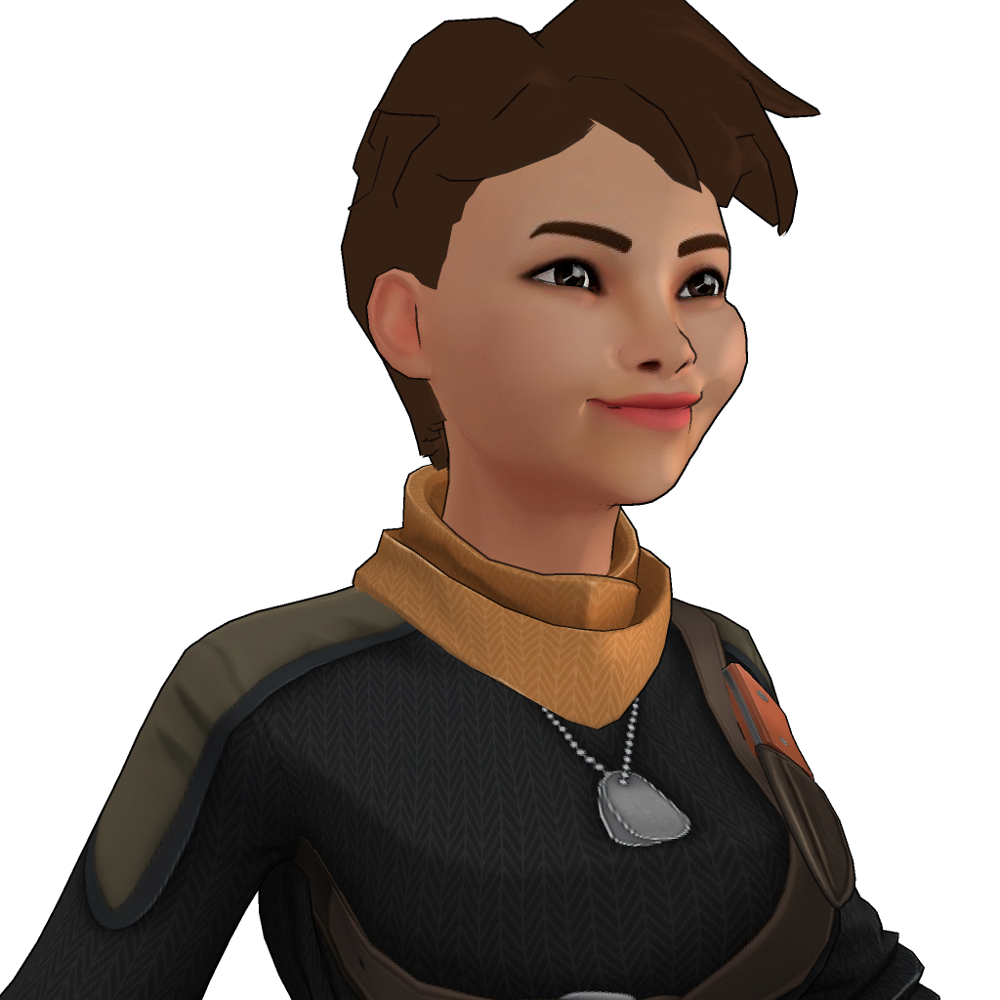
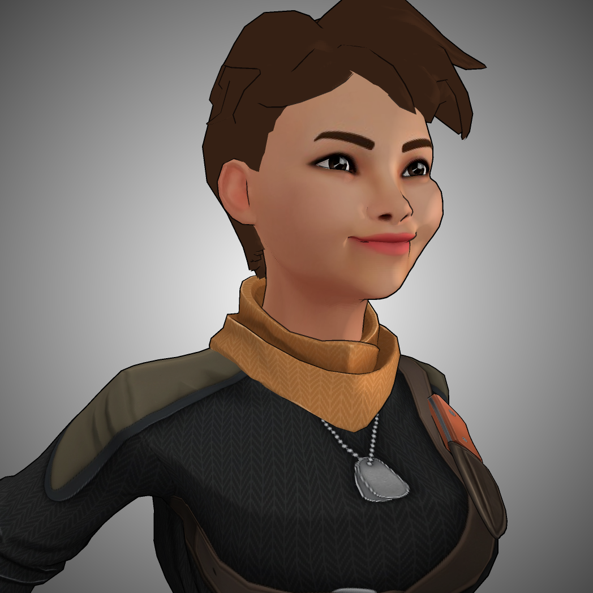
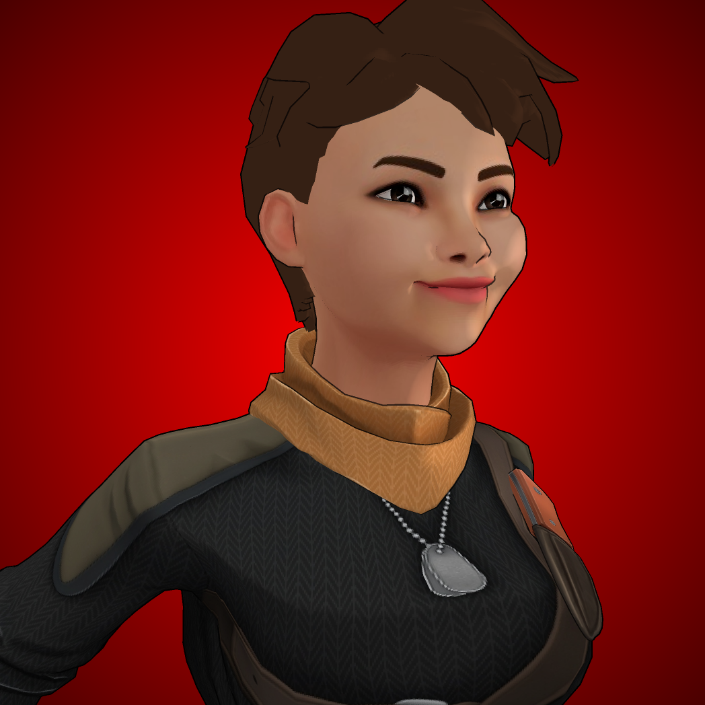
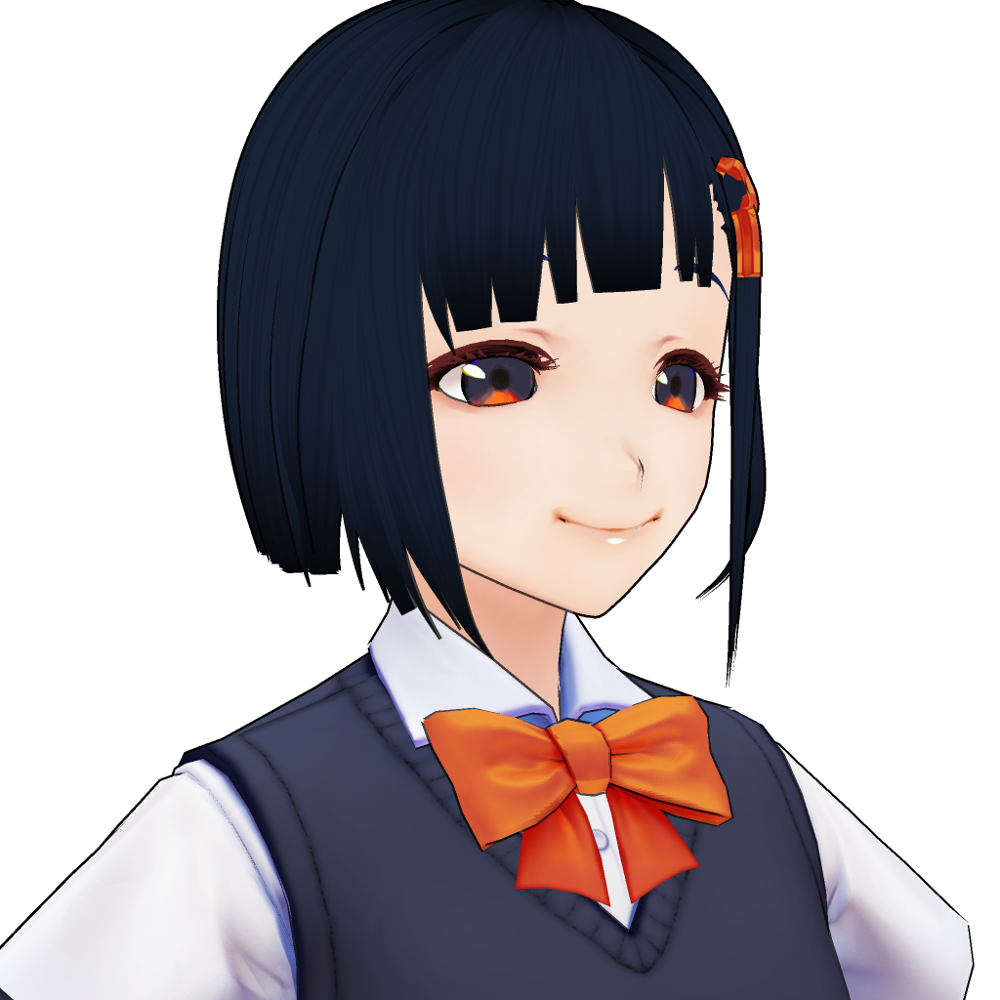
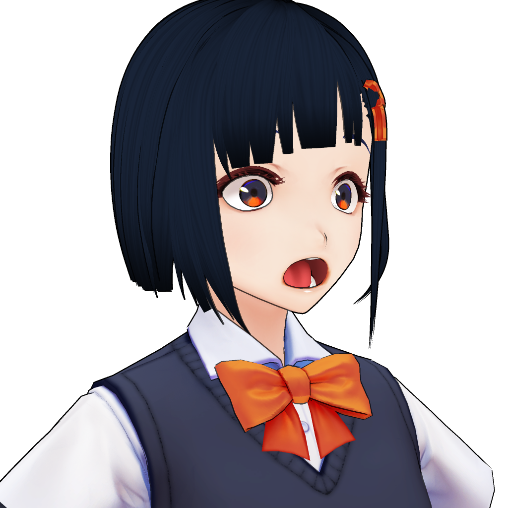

# :diamond_shape_with_a_dot_inside: Raster

A software renderer which does not require any GPU resources. Works without Vulkan, OpenGL nor Metal. Written in C++11, currently only supports [glTF](https://www.khronos.org/gltf/) binary (`.glb`) and [VRM](https://vrm.dev/en/) (`.vrm`) models as input, and PNG image format for output.

**[[[Work In Progress]]]**

## Features

- [x] glTF (.glb) as input
- [x] VRM (.vrm) as input
- [x] PNG output
- [x] Shader in C++
- [x] Backface culling
- [x] Vertex skinning
- [x] Tangent space normal mapping
- [x] Orbital camera control
- [x] Inverted hull outline
- [x] Blinn-Phong reflection
- [x] Vertex colors
- [x] SSAA (anti-alias)
- [x] Morph targets
- [x] Lit, Unlit
- [x] Outline lighting mix (MToon)
- [x] Outline width mask (MToon)
- [x] Vignette effect
- [ ] MToon shading

## Usage (Standalone renderer)

```
> Raster --input INPUT.glb --output OUTPUT.png
```

### Options

* `--input`: Input file name
* `--output` Output file name
* `--verbose`: Verbose log output
* `--silent`: Silent log output
* `--ssaa`: Enable SSAA (Anti-Alias)
* `--outline`: Enable outline (Inverted Hull)
* `--vignette`: Enable vignette effect

## Renderng Samples

### Ready Player Me

#### Lit with outline & morph
 

### Lit with outline & morph & vignette
 

### VRoid (Unlit with outline & morph)
 

## Usage (As a library)

Raster is built to be integrated with applications of your choice as an external library. Raster has easy to use API that enables you to view glTF models as an image, without any GPU dependencies such as Vulkan and OpenGL.

```c++
#include "raster.h"

using namespace renderer; // namespace for Raster

int main(int argc, char **argv)
{
    Scene scene;

    scene.options.input = "model.glb"; // input 3D model
    scene.options.verbose = false; // verbose log output
    scene.options.silient = false; // silent log output

    // Read from glTF
    if (!loadGLTF(input, scene)) {
        return 1;
    }

    // Render
    Image outputImage;
    if (!render(scene, outputImage)) {
        return 1;
    }

    // Save to image
    if (!save("model.png", outputImage)) {
        return 1;
    }

    return 0;
}
```

## Image memory layout

The Image object you can construct from `render()` consists of an array of the pixel data, which is unsigned 8bit integer (`uint8_t`) for each colors (RGBA). Note that these color value ranges `(0 to 255)` unsigned integer value. You can use `Color Image::get(uint32_t x, uint32_t y)` in order to get color of given x-y position, like following:

```c++
// Render
Image outputImage;
if (!render(scene, outputImage)) {
    return 1; // This means rendering failed
}

// Get color at position (x=100, y=200)
Color color = outputImage.get(100, 200);

uint8_t red = color.R();
uint8_t green = color.G();
uint8_t blue = color.B();
uint8_t alpha = color.A();
```

## License

* Available to anybody free of charge, under the terms of MIT License (see LICENSE).

## Building

You need [CMake](https://cmake.org/download/) in order to build this. On Windows you also need Visual Studio with C++ environment installed.
Once you have CMake installed run cmake like this:


```
> mkdir build; cd build
> cmake ..
```

